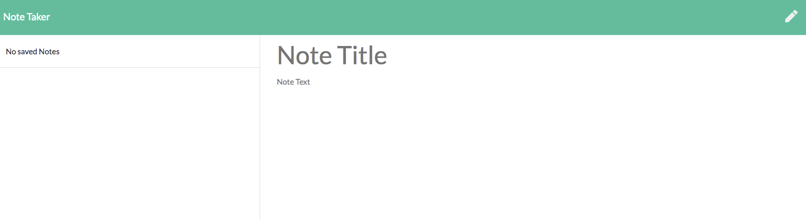

# lekas-notes-taker
Simple Application to allow user to keep notes

Using this application you can add notes for later.
As you add notes they will apear on the left side.

Viwing notes:
You can view old notes by clicking on the Note title.
You can add new note by clicking on the Pen icon on the right.

You can delete the note by clicking on the bin icon next to the title of the note.

The following image demonstrates the web application's appearance:

This application was posted on Huroku.
You can view demo of this application here:
https://lekas-note-taker.herokuapp.com/notes.